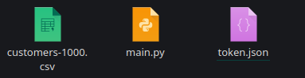

# CSV to GDocs test project

## Requirement:
1. Python 3 with packages:
    - Pandas 2.2.1
    - Google API Client 2.122.0
2. Google Cloud

## How to setup
1. Clone repo:
`git clone https://github.com/DrViruss/CSV_to_GDocs.git`
2. Prepare your GCloud project with [this guide](https://developers.google.com/sheets/api/quickstart/python)
3. Put authentication .json file to project folder and rename authentication file to `token.js`

4. Run `python main.py`

6. Go to [GDrive](https://drive.google.com/drive/my-drive) and open `customers-1000` file

